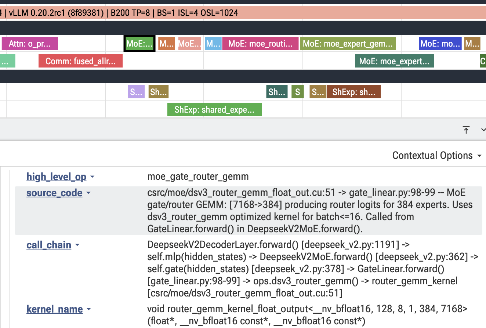

# Single-Trace Analysis and High-Level Trace Annotation

## Motivation

When profiling LLM inference frameworks (vLLM, SGLang, TensorRT-LLM), a raw GPU
trace in Perfetto shows hundreds of low-level CUDA kernels with cryptic names
like `cutlass_sm100_gemm_f16_64x128x32`. Understanding which transformer operation
each kernel belongs to — attention projection, MoE routing, allreduce — requires
manually tracing the source code call chain for every kernel, which is extremely
time-consuming.

The single-trace analysis pipeline automates this entirely. It:

1. **Analyzes the framework source code** to identify the high-level operations
   in each transformer block type (attention projections, MoE routing, allreduce, etc.)
2. **Extracts all GPU operations** from the trace with timestamps, streams, and
   launch parameters
3. **Correlates every low-level kernel** to its high-level transformer block
   operation through source code deep-dive analysis
4. **Produces an annotated trace** (`single_trace_transformer_block.json`) that
   you can open in [Perfetto](https://ui.perfetto.dev) where every kernel is
   labeled with its high-level operation name, source code references, and call chain

This gives you an instant, unified view of high-level to low-level operation
mapping across all CUDA streams — no manual source code tracing needed.

The single-trace analysis is also the foundation for **cross-commit comparison**,
where two single-trace results are compared to identify kernel-level performance
differences between framework versions. See
[Cross-Commit Performance Comparison](cross_commit_comparison_guide.md) for the
next step after completing single-trace analysis.

## What the Annotated Trace Contains

When you open the annotated trace in Perfetto, each kernel event includes:

- **High-level operation name** — e.g., `fused_qkv_a_proj_gemm`, `flashinfer_mla_decode_attn`, `moe_expert_gemm1_gate_up_silu`
- **Category prefix** — e.g., `Attn:`, `MoE:`, `Comm:`, `ShExp:` for quick visual grouping
- **Source code references** — file:line locations in the framework source code
- **Call chain** — the full call path from the decoder layer's `forward()` method down to the kernel launch
- **CUDA stream layout** — operations are organized by their actual CUDA streams, with overlap lanes for concurrent execution (PDL)

## End-to-End Walkthrough

This walkthrough uses vLLM with the Kimi-K2.5 model on B200 GPUs as a concrete
example. The same process applies to any framework and model.

### Prerequisites

- A framework source code directory (clean git repo, no uncommitted changes)
- Access to the target model on HuggingFace

### Step 1: Generate a PyTorch Trace

First, capture a profiling trace of the workload you want to analyze. See
`auto_analyze/examples/vllm_generate_trace_example.md` for detailed instructions
on server/client trace generation.

The key outputs from this step are:
- A **trace file** (`.json.gz` PyTorch Chrome trace, or `.nsys-rep` / `.sqlite` NSYS trace)
- A **run log** containing the full execution output, including the run command at the top

### Step 2: Set Up Parameters

Define the parameters that describe your run. These must match the exact
configuration used when generating the trace.

```bash
# --- Model and hardware ---
MODEL="nvidia/Kimi-K2.5-NVFP4"
GPU_TYPE="B200"

# --- Execution parameters (must match the trace) ---
BATCH_RANGE="1"          # Batch size used
PREFILL_RANGE="4"        # Input / prefill sequence length
OUTPUT_RANGE="1024"      # Output / decode sequence length

# --- Input files ---
TRACE_FILE="/path/to/trace/rank0.pt.trace.json.gz"
RUN_LOG="/path/to/run_log.txt"

# --- Framework source code (must be a clean git repo) ---
SOURCE_CODE="/path/to/vllm"
COMMIT_ID="8f89381fc6b2d54591a7a560e20ee5211ce1ac33"  # or "HEAD"

# --- Output paths ---
ANALYZE_OUTPUT_DIR="/path/to/analysis_output"
OUTPUT_CONFIG_FILE="/path/to/single_trace_config_kimi_vllm"
```

**Notes:**
- `TRACE_FILE`: For PyTorch traces with tensor parallelism, each GPU produces a
  separate trace file. Pick any single rank (e.g., rank 0) — they all execute the
  same operations.
- `COMMIT_ID`: The exact git commit of the framework used during the trace capture.
  Use `"HEAD"` if the source code is already at the correct commit.
- `SOURCE_CODE`: Must be a clean git repo with no modified or uncommitted files.
  The analysis automatically creates a separate branch for the specified commit ID.

### Step 3: Create the Analysis Config

Use the helper script to generate the config JSON:

```bash
python -m auto_analyze.create_single_trace_config \
    --model $MODEL \
    --gpu-type $GPU_TYPE \
    --batch-size-range $BATCH_RANGE \
    --prefill-size-range $PREFILL_RANGE \
    --output-size-range $OUTPUT_RANGE \
    --trace-file $TRACE_FILE \
    --run-log-file $RUN_LOG \
    --clean-source-code-path $SOURCE_CODE \
    --commit-id $COMMIT_ID \
    --analyze-output-dir $ANALYZE_OUTPUT_DIR \
    --output-config-file $OUTPUT_CONFIG_FILE
```

This will:
- Infer the framework name from the run log (e.g., `vllm`)
- Extract the run command from the run log
- Verify the commit ID exists in the source code repo
- Write the config JSON to `$OUTPUT_CONFIG_FILE.json`

**Optional parameters** for more targeted analysis:

```bash
    --high-level-focus "Focus on pure decode execution and low-latency batch sizes" \
    --perf-analysis-focus "Pay special attention to torch.compile fusion opportunities" \
    --trace-gpu-focus "0" \
    --max-gpu-ops 1000
```

### Step 4: Run the Analysis

```bash
python -m auto_analyze.run_single_trace --config $OUTPUT_CONFIG_FILE.json
```

The analysis pipeline executes these steps automatically:

1. **High-level operations** — Reads the framework source code and identifies the
   sequence of logical operations in each transformer block type (attention
   projections, MoE routing, allreduce, etc.)

2. **GPU operations extraction** — Parses the trace file and extracts all GPU
   kernel events with timestamps, streams, and launch parameters.

3. **Operation correlation** — Correlates every low-level GPU kernel to its
   high-level transformer block operation through source code deep-dive analysis.
   Selects the median transformer block as the representative block.

4. **Annotated trace generation** — Produces a Chrome trace JSON for the median
   transformer block with every kernel labeled with its high-level operation,
   source code references, and call chain.

### Step 5: View in Perfetto

Open the annotated trace in Perfetto:

1. Go to [https://ui.perfetto.dev](https://ui.perfetto.dev)
2. Open `$ANALYZE_OUTPUT_DIR/single_trace_transformer_block.json`
3. Click any kernel to see its high-level operation, source code location, and call chain

Below is an example of the annotated trace for Kimi-K2.5-NVFP4 on vLLM, showing
kernel operations organized by CUDA stream with high-level labels, source code
references, and call chains visible in the detail panel:



A human-readable summary is also available at
`$ANALYZE_OUTPUT_DIR/single_trace_transformer_block.txt`.

## Output Files

After the analysis completes, the output directory contains:

| File | Description |
|------|-------------|
| `single_trace_transformer_block.json` | Annotated Chrome trace JSON — open in Perfetto |
| `single_trace_transformer_block.txt` | Human-readable summary of the annotated trace |
| `transformer_block_high_level_ops.txt` | High-level operation sequence from source code analysis |
| `gpu_ops.txt` | Raw GPU operations extracted from the trace |
| `gpu_ops_to_blocks.txt` | Full correlation of GPU ops to transformer blocks |
| `median_block.txt` | The selected median transformer block |
| `run_params.txt` | Run parameters for downstream tools |
| `run_originals/` | Copies of the original trace file, run command, and run log |

## Optional: Enable Performance Analysis

By default, the config generator disables performance analysis to keep the run
focused on trace annotation. To also generate a detailed performance analysis
with improvement proposals, add:

```bash
python -m auto_analyze.create_single_trace_config \
    ... \
    --enable-single-trace-perf-analysis
```

This adds a `perf_analysis_single_trace.txt` output with bottleneck identification,
improvement proposals with code snippets, and impact estimates.

## Next Step: Cross-Commit Comparison

Once you have single-trace analysis results for two commits of the same framework,
you can compare them to identify kernel-level performance differences — which
operations improved and which regressed between versions.

See [Cross-Commit Performance Comparison](cross_commit_comparison_guide.md) for
the full walkthrough.
